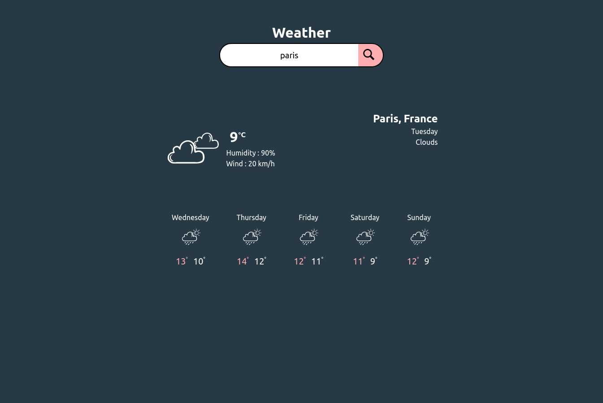

# Weather Application

## Table of contents

- [Overview](#overview)
  - [Screenshot](#screenshot)
- [My process](#my-process)
  - [Built with](#built-with)

## Overview

### Screenshot

## My process

### Built with

- Semantic HTML5 markup
- CSS custom properties
- Flexbox
- CSS Grid
- Mobile-first workflow
- [React](https://reactjs.org/) - JS library

### OpenWeather API
Generate OpenWeather Api Key https://openweathermap.org/appid#apikey and set the REACT_APP_OPEN_WEATHER_API_KEY value in your .env
